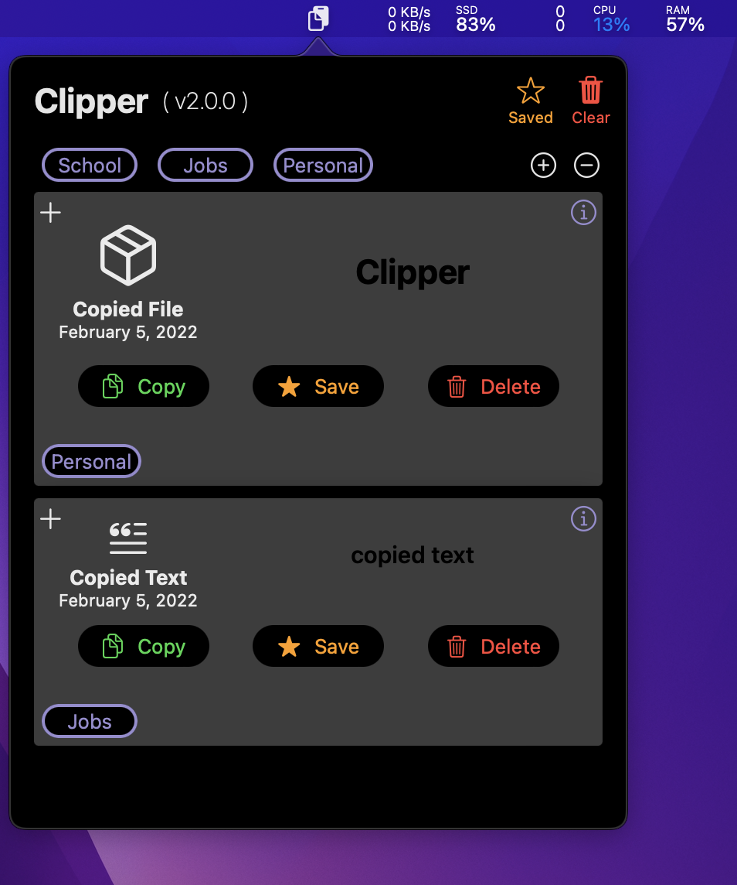

# Clipper

A compact but powerful clipboard manager in macOS from the menu bar.

## Installation
### Manual Installation
The DMG Installer has been released on this github repository. You can download the installer alongside the source code under the Releases tab.

Or you can simply click [here](https://github.com/AshwinChugh/Clipper/releases/tag/v2.0.0). A Clipper.dmg file will be downloaded. Open it and move the application into your applications folder. For optimal usage, enable Clipper to start when you log into your Mac.

### Automatic Installation
Currently working on getting Clipper on the Mac App Store for a more streamlined and seamless installation experience.

### Setting Clipper to Start at Login
1. Open System Preferences
2. Click on "Users and Groups"
3. Ensure that the current user is your account
4. Click on the "Login Items" button
   * This is located right next to the passwords button
5. Click on the '+' button located near the bottom of the window
6. Select Clipper
   * Ensure that you are located in the Applications directory (or the directory where you installed Clipper if you did not install Clipper in Applications)

## Requirements
The latest release of Clipper will only run on macOS 11.0 (Big Sur) or higher.

## Features
Clipper is a lightweight and powerful Clipboard Manager. A list of currently supported features is below:

### Automatic Updates
* Constant tracking and monitoring of changes to the system clipboard
* Instant UI updates for any new content copied to the clipboard

### Clipboard History
* Copy previously stored data
   * Data that was previously copied on the clipboard can be accessed and copied to the clipboard from Clipper
   * If the data is saved, content from previous sessions (shutdowns/restarts) can also be copied

### Persistence
* Persistence with Clipboard content.
   * Content saved (indicated by the yellow star) will persist across different sessions and application restarts
   * Restarting or shutting down your mac will NOT result in a loss of data that is saved
   * Note that non-saved data will be lost
* Sort between saved and non-saved data
   * Toggling the star button on the top-right corner of the popover will only display saved content.

### User Control
* Delete content on demand
   * Clicking delete on data will remove the item from Clipper's history
   * Note that this operation is irreversible -- Data deleted is data gone forever (until copied back onto the clipboard)
   * Deleting saved data will make Clipper automatically unsave and delete that data completely
   * You can not delete the latest item that is currently copied to your system Clipboard
      * Clipper will automatically add the item back when it checks for any changes on the system Clipboard
* Clearing clipboard history
   * Clicking the clear all button will clear the system clipboard
   * The button will also delete and remove all **non-saved** items

### Categories
* Create unlimited categories to group clipboard items
* Clicking on the category button on the top will only show items that have been assigned to that category
* Items can be assigned to multiple categories
* Categories must be unique
   * The plus button on each item will open a view to assign new categories to the item
   * The info button on the opposite side of the plus button will show all categories the item has been assigned to
* Buttons will be disabled if there are no categories or if the item has not been assigned to any
* **[IMPORTANT] To remove a cateogory from an item, triple click the category from the button's info view**

## Images
Detail view of Clipper with no options/filters applied.
The info button for each item has been clicked to show each item's category.

Creating a category

Assign a category to a cipboard item. Click on the plus button to open the category assigner view.

Filter items according to a selected category

Delete a category

## Contributing
Clipper is open-source and free to any developers who are interested in making their own personal tweaks and modifications. If you are interested in contributing directly to this repository, feel free to contact me [here](https://www.ashwinc.me/#Contact).

Otherwise, developers are encouraged to fork this repository and design a version of Clipper that meets their desired expectations.

## Disclaimers
While using Clipper, you may come across various bugs and errors. If you are fortunate enough to face such a situation, please create an issue on this repository or contact me [here](https://www.ashwinc.me/#Contact)!
